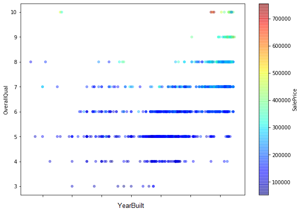
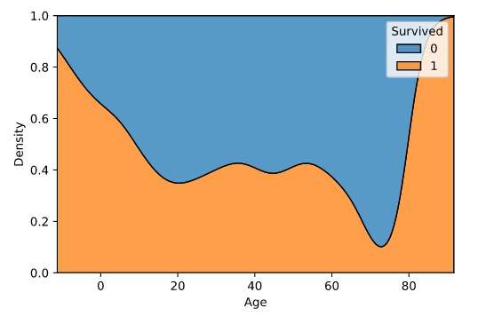

# Data science portfolio by Fuki Babasaki
Hi! I am a 3rd year software engineering student, learning data science practices. My interests include statistics and I hope to improve my data analysis skills and explore more ML algorithms through building this portfolio! Mainly using pandas, matplotlib and seaborn to visualise data and scikit-learn to preprocess data, build, evaluate and hyper-tune models.

## Dependencies
The code is in Python 3.6+ with common packages for machine learning and data analysis. There is requirement.txt in this repository and you can:

```bash
$ python -m pip install -r requirements.txt
```

## Regression problems
### House prices: Advanced Regression Techniques
[GitHub](https://github.com/Fuki-UoA/Data-science-portfolio/blob/main/Notebooks/Supervised/House-price-prediction/House%20price%20prediction.ipynb) 
House prices: Advanced Regression Techniques is a knowledge competition on Kaggle. 

- Created a model that estimates the prices based on the information of houses. 
- Conducted data cleaning as there were some missing data, and categorical values. 
- Selected performance measure is Root Mean Square Error (RMSE) 
- Linear Regression, Adaboost and Random Forest regression were considered for a model. Cross-validation was used for evaluation.
- Final model I chose is Random Forest regressor, and GridSearchCV was used for best hyper-parameters.
- The description and data are available [here](https://www.kaggle.com/c/house-prices-advanced-regression-techniques) on Kaggle.


## Classification problems

### Hiragana Recogniser

[GitHub: Notebook](https://github.com/Fuki-UoA/hiragana-recogniser/blob/main/ml/hiragana-classificationV2.ipynb) [GitHub: Repo](https://github.com/Fuki-UoA/hiragana-recogniser) 

Multi-label classification problem with 70 classes.

- Dataset is from [here](http://etlcdb.db.aist.go.jp/specification-of-etl-8)
- Cleaned dataset as there were instances corresponding to non-hiragana characters.
- Applied CNN, early stopping (for epochs) and data augmentation.
- Achieved over 98.8% accuracy on the test set.


### Titanic - Machine Learning from Disaster 

[GitHub](https://github.com/Fuki-UoA/Data-science-portfolio/blob/main/Notebooks/Supervised/Titanic-classification/titanic-classification.ipynb) 

It is a typical *binary classification problem* where the main goal is to build a binary classifier.

- Built a model predicting whether or not a person can survive the Sinking of the Titanic.
- Exploratory analysis includes conditional density plot.
- My data cleansing pipeline include a custom imputer and Standard Scalier for numeric values, and Simple Imputer and One-hot Encoder for categorical values.
- Models shortlisted: *Stochastic Gradient Descent (SGD)*, *Random Forest Classifier*, *K-Nearest Neighbour*, and *Support Vector Machine (SVM)*
- SVM performed the best and therefore, was hyper-tuned.
- The description and data are available [here](https://www.kaggle.com/c/titanic) on Kaggle.


